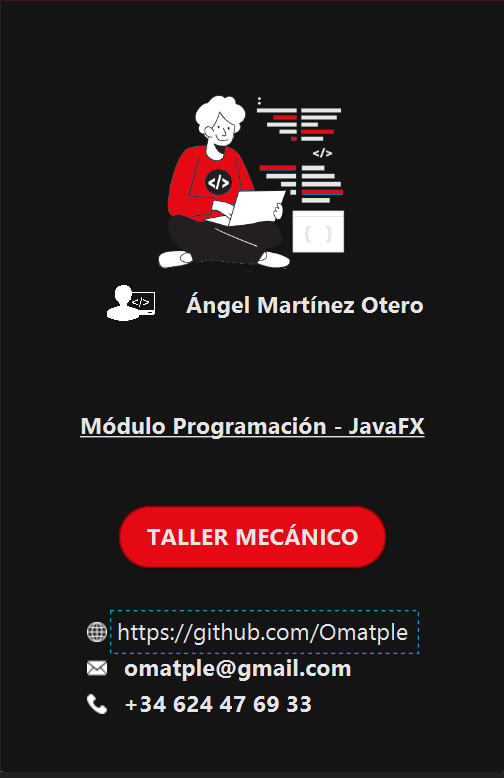
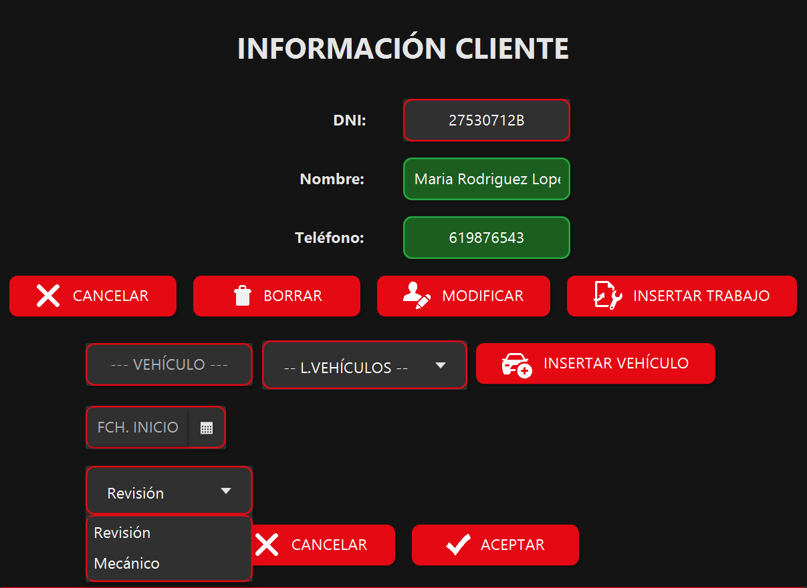
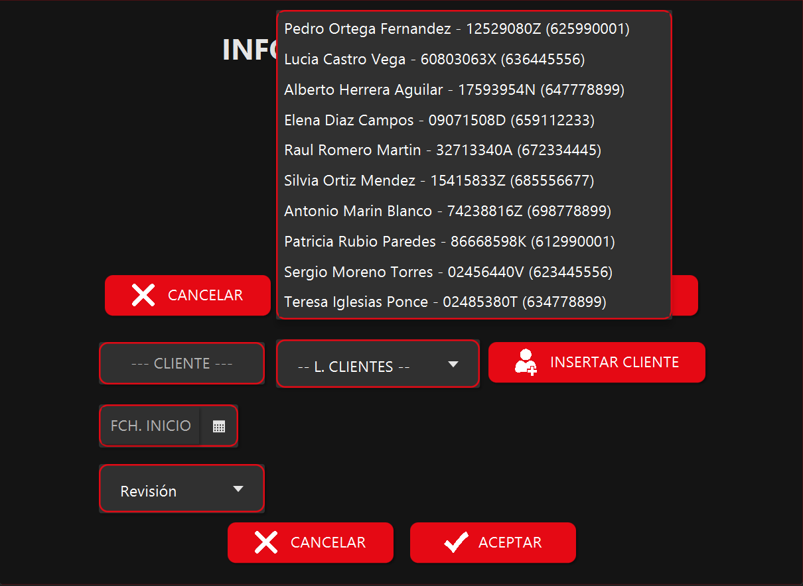
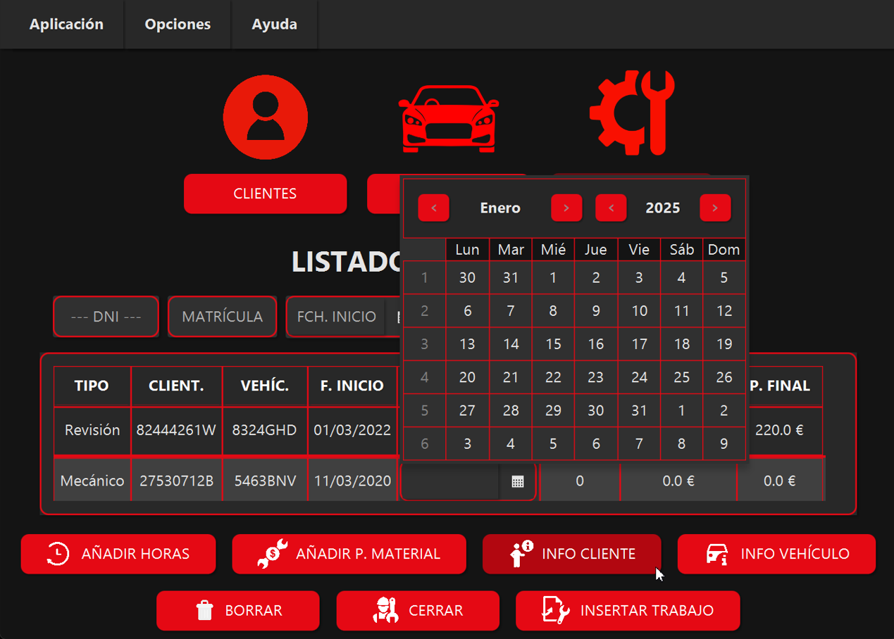
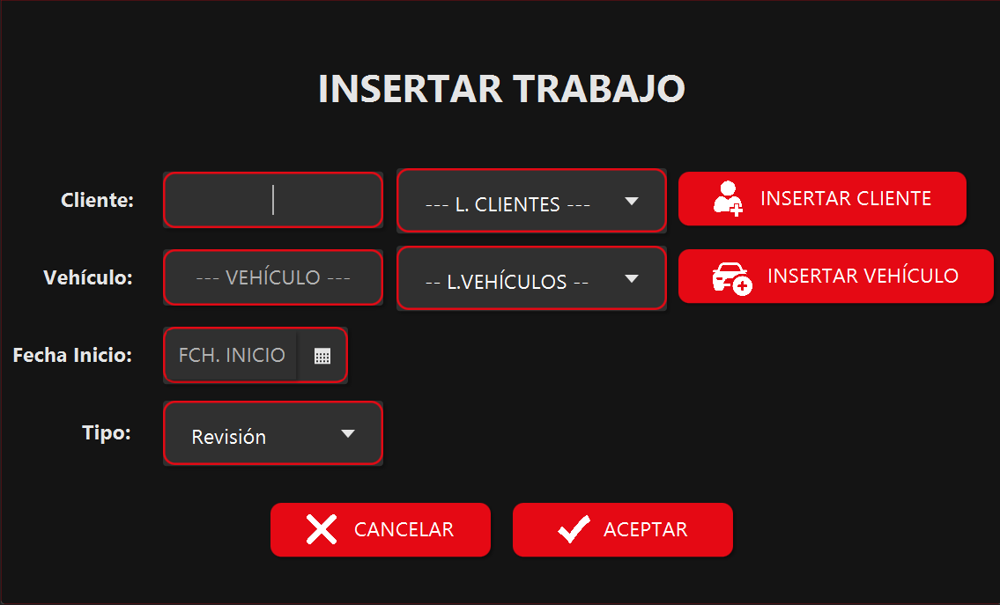
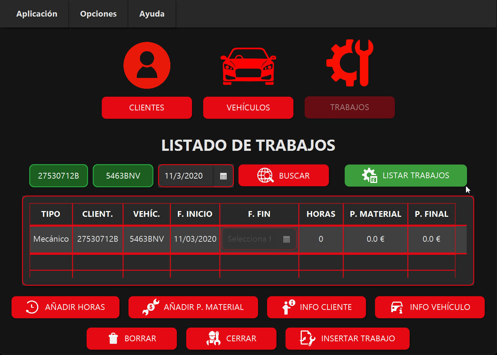
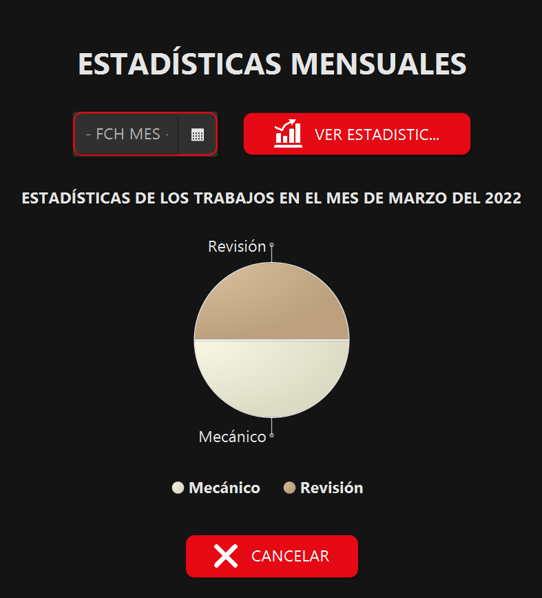
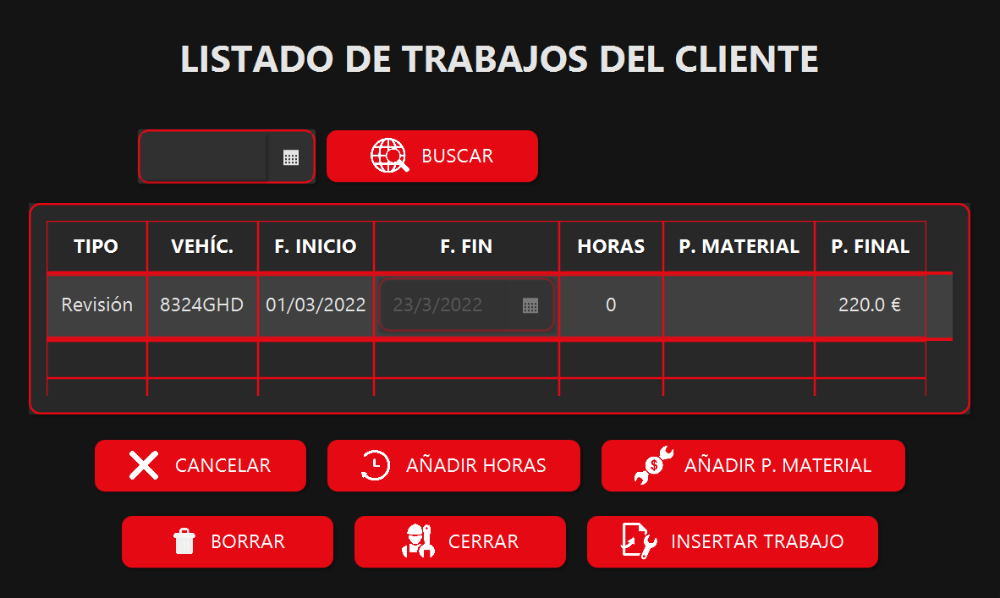

# Taller Mecánico - Aplicación de Gestión

Bienvenido a la documentación del proyecto **Taller Mecánico**, una aplicación profesional desarrollada en JavaFX diseñada para simplificar y automatizar la gestión de talleres mecánicos. Este proyecto combina una interfaz moderna y funcional con una estructura de código bien organizada, ofreciendo soluciones eficientes para la administración de clientes, vehículos y trabajos.

---

## Tecnologías Utilizadas

- **Lenguaje:** Java
- **Framework:** JavaFX
- **Base de Datos:** MySQL
- **IDE:** IntelliJ IDEA
- **Control de Versiones:** Git y GitHub
- **Gráficos:** Librería JavaFX Charts

---

## Características Principales

- Gestión completa de clientes, vehículos y trabajos.
- Búsqueda personalizada por DNI, matrícula o fecha.
- Inserción, modificación y eliminación de datos con validaciones.
- Generación de gráficos estadísticos mensuales.
- Mensajes de confirmación, error y éxito para mejorar la experiencia del usuario.

---

## Capturas de Pantalla

### Pantalla de Inicio

- Información general del taller y del desarrollador.
- Enlaces directos a GitHub, correo electrónico y teléfono.

### Gestión de Clientes

- Listado de todos los clientes registrados.
- Opciones:
  - Buscar clientes por DNI.
  - Insertar, modificar y borrar clientes.
  - Acceder a trabajos asociados.

### Gestión de Vehículos

- Visualiza y gestiona los vehículos registrados.
- Funciones:
  - Buscar vehículos por matrícula.
  - Insertar, modificar y eliminar vehículos.

### Información de Cliente

- Detalles individuales de un cliente:
  - DNI, nombre y teléfono.
- Opciones:
  - Modificar datos.
  - Insertar vehículos o trabajos relacionados.

### Información de Vehículo

- Detalles del vehículo:
  - Matrícula, marca y modelo.

### Listado de Trabajos

- Visualiza todos los trabajos realizados.
- Opciones:
  - Añadir horas y materiales.
  - Acceder a información del cliente o vehículo asociado.
  - Borrar trabajos registrados.

### Insertar Trabajo

- Permite registrar un nuevo trabajo seleccionando:
  - Cliente.
  - Vehículo.
  - Fecha de inicio.
  - Tipo de trabajo (Revisión, Mecánico, etc.).

### Estadísticas Mensuales

- Generación de gráficos estadísticos interactivos.
- Muestra la distribución de los tipos de trabajos realizados en un mes seleccionado.

### Listado de Trabajos del Cliente

- Detalla los trabajos realizados para un cliente específico.
- Opciones:
  - Añadir horas y materiales.
  - Editar o eliminar trabajos existentes.

---

## Arquitectura del Proyecto

El proyecto está diseñado bajo los principios de la arquitectura MVC (Modelo-Vista-Controlador) para garantizar una separación clara entre la lógica de negocio, la presentación y la interacción con el usuario.

### Estructura de Paquetes

- **Modelo:** Contiene las clases que representan los datos (Clientes, Vehículos, Trabajos) y las conexiones con la base de datos.
- **Vista:** FXML y controladores JavaFX para las interfaces.
- **Controlador:** Lógica de negocio y coordinación entre modelo y vista.

---

## Contacto

Para más información o sugerencias, contáctame en:

- **GitHub:** [github.com/Omatple](https://github.com/Omatple)
- **Correo:** <omatple@gmail.com>
- **Teléfono:** +34 624 47 69 33

---

Gracias por explorar este proyecto. Tu opinión y comentarios son bienvenidos para seguir mejorando.
